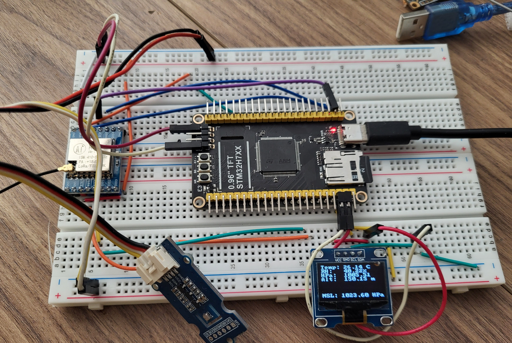

# H750 BME280 Timer

This project documents my effort learning about STM32 MCUs, and more specifically right now the H750. I started small, with an OLED – I can't seem to be able to use the TFT that was provided with the board. So... identify I2C pins, connect, use a good library that's known to work, and off we go. Then I added a BME280 – it's on the I2C bus anyway so no hardship here.

I had a slightly more complicated time wiring the LoRa chip – there are so many pins on this board, and the pinout is UNDER the borad, not on the top side, but after a few tries, I had a Frankenstein machine that worked. Every 30 seconds – that's way too often, but I am too impatient to wait when doing tests! – the MCU reads data from the BME280, displays it on the OLED and Serial, and sends it via LoRa. All nice and good.



But this is hardly learning for me. I have done this multiple times on various boards. I wanted to learn about STM32-specific capabilities. And one of them is timers. Something that STM32 MCUs do well.

The first attempt was to make a LED blink – the `LED_BUILTIN` (PE3 on this board), but also an external LED connected to a PWM pin. This too was easy enough, thanks to a pair of articles:

* [Minimal STM32 HardwareTimer PlatformIO / Arduino timer interrupt blink example](https://techoverflow.net/2021/09/22/minimal-stm32-hardwaretimer-platformio-arduino-timer-interrupt-blink-example/)
* [All-in-one_setPWM.ino] (https://github.com/stm32duino/STM32Examples/blob/main/examples/Peripherals/HardwareTimer/All-in-one_setPWM/All-in-one_setPWM.ino)

The latter was particularly interesting because it creates a Timer and sets i t up to blink a LED, without CPU load.

```c
void setup() {
  // no need to configure pin, it will be done by HardwareTimer configuration
  // pinMode(pin, OUTPUT);

  // Automatically retrieve TIM instance and channel associated to pin
  // This is used to be compatible with all STM32 series automatically.
  TIM_TypeDef *Instance = (TIM_TypeDef *)pinmap_peripheral(digitalPinToPinName(pin), PinMap_PWM);
  uint32_t channel = STM_PIN_CHANNEL(pinmap_function(digitalPinToPinName(pin), PinMap_PWM));

  // Instantiate HardwareTimer object. Thanks to 'new' instantiation, HardwareTimer is not destructed
  // when the setup() function is finished.
  HardwareTimer *MyTim = new HardwareTimer(Instance);

  // Configure and start PWM
  MyTim->setPWM(channel, pin, 5, 10); // 5 Hertz, 10% dutycycle
}
```

That's it. Note that the `setPWM` function can take also a callback and a compare callback, so if you want to do extra processing, you can add one or the other to the function call. Since the built-in LED is not PWM on my board, I used a callback to blink it, separately.

The other article taught me how to set up a hardware timer. `TIM1` is used in the example, but the `variant.h` file for my board says to use, if possible, `TIM6` or `TIM7`. So that's what I did.

```c
    timer.setPrescaleFactor(2564);
    // Set prescaler to 2564 => timer frequency = 168MHz/2564 = 65522 Hz (from pre-devided by 1 clocksource of 168 MHz)
    timer.setOverflow(32761);
    // Set overflow to 32761 => timer frequency = 65522 Hz / 32761 = 2 Hz
    timer.attachInterrupt(OnTimer1Interrupt);
    timer.refresh(); // Make register changes take effect
    timer.resume(); // Start
}
```

The H750 runs at 480, so I had to recalculate the prescaling factor and the overflow. When I had this working, I decided to apply this to the BME280 example. I played around with values until I had a combination that gave me 10 seconds, and added a counter. Every 3 callbacks, I call the `showData()` command.

```c
HardwareTimer MyTimer(TIM6);
uint8_t count = 0;
void OnTimer1Interrupt() {
  count++;
  if (count == 3) {
    showData(); // 3 x 10 seconds
    count = 0;
  }
}
```

Simple enough and quite flexible. I can switch to 60 seconds, or any multiple of 10, by changing just the one value.

```c
  MyTimer.setPrescaleFactor(36818);
  MyTimer.setOverflow(65536); // 480000000/7234/32768 = 2 Hz. 1 second at full speed, 2 s at half speed
  // 32768 / 65536 = 8.9 s
  // 36818 / 65536 = 10 s
  MyTimer.attachInterrupt(OnTimer1Interrupt);
  MyTimer.refresh(); // Make register changes take effect
  MyTimer.resume(); // Start
```

And that was it. The code runs on its own, and the `showData()` command is called every 30 seconds, like clockwork, pun intended.
